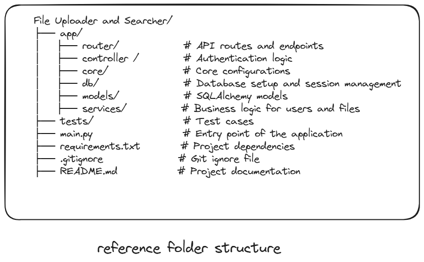

# File Uploader and Searcher

## 1. Objective

A web application that allows users to upload files and search through the uploaded directory.

## 2. Scope

### Features

- Uploading a document (PDF).
- Searching through the directory.
- User authentication and authorization.

## 3. Requirements
### Priority 1 (P1)

- MySQL connected with FastAPI.
- Proper folder structure.
- Uploading files through a user's session.
- Search filters to search through files.

### Priority 2 (P2)

- Documentation, such as comments in the code, to make it easier to understand.
- User authorization.
- Postman test report.
- API testing (e.g., [Katalon API Testing Guide](https://katalon.com/resources-center/blog/test-cases-for-api-testing)).

## 4 . User stories

### User need to upload an pdf file and serch on need

Users can sign up and log in securely to access the system. Once logged in, they can upload their resumes in PDF format and store them in the database. They can also search through uploaded resumes using keywords to quickly find relevant documents. The system ensures only valid PDF files are accepted and provides clear error messages if something goes wrong.

## Techicial Reqierment

- **Python**: Core programming language.(reqired)
- **FastAPI**: Web framework for building APIs.(reqired)
- **MySQL**: Database for storing user and file data.(reqired)
- **SQLAlchemy (ORM)**: Lightweight and faster ORM for database operations.
- **bcrypt**: For password hashing.
- **JWT**: For secure user authentication.
- **Postman**: For API testing.

## File stucuture

## Design Requiements

**- no need**

## Deadline

-(10/4/24)
