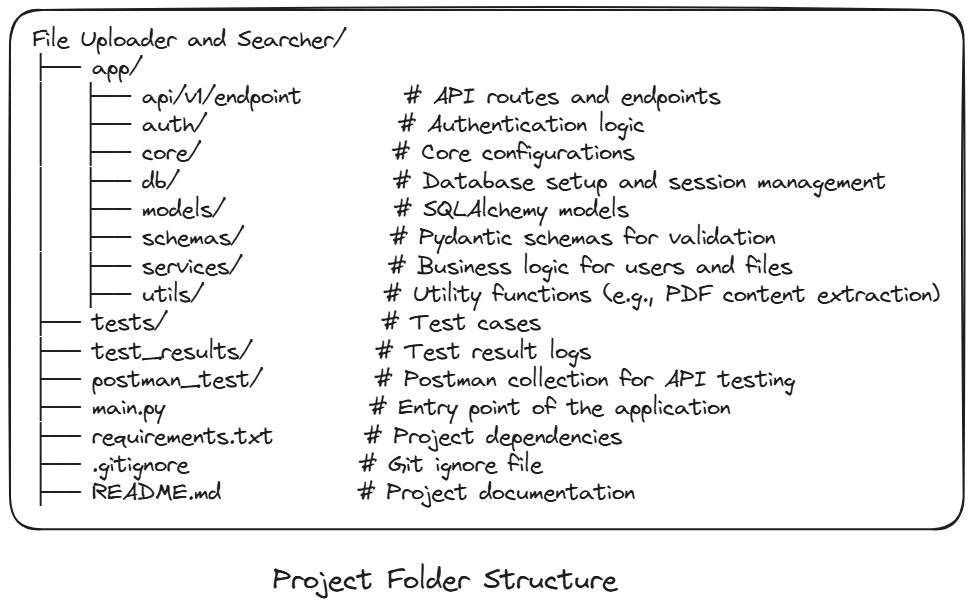

# File Uploader and Searcher

A FastAPI-based web application for uploading, and searching files using MYSQL. 

---

## Features

- **User Authentication**: Secure user login and registration using JWT tokens.
- **File Upload**: 
   - Upload files to the server with proper validation.
   - Extracts content from PDF files for search functionality.
- **File Search**: 
   - Search for uploaded files based on metadata or content of the file.
   
- **Database Integration**: Uses SQLAlchemy for database operations.
- **Modular Design**: Organized into reusable components for scalability.
- **API Documentation**: Automatically generated Swagger UI and ReDoc.

---

## Technologies Used

- **FastAPI**: For building the web API.
- **SQLAlchemy**: For database ORM.
- **Pydantic**: For data validation.
- **PyMySQL**: For MySQL database connection.
- **JWT (JSON Web Tokens)**: For secure user authentication.
- **Uvicorn**: For running the FastAPI server.
- **Alembic**: For automating and managing database schema migrations.
---

## Installation

### Prerequisites
- Python 3.10 or higher
- MySQL database (or any other supported database)

### Steps
1. Clone the repository:
   ```bash
   git clone <repository-url>
   cd File-Uploader-and-Searcher
2. Create a virtual environment:
   ```bash
      python -m venv venv
      source venv/bin/activate  # On Windows: venv\Scripts\activate
3. Install dependencies:
   ```bash
   pip install -r requirements.txt
4. Set up environment variables:

- Create a .env file in the root directory by using .env_example

5. Start the server:
   ```bash
    uvicorn main:app --reload

6. Access the API documentation:

*Swagger UI*: http://127.0.0.1:8000/docs
OR 
*Postman*: Use the Postman collection in the `postman_test/` folder.

## Project Structure



## Testing
1. Install pytest and pytest-asyncio (already in requirements.txt):
    ```bash
    pip install pytest pytest-asyncio

2. Run the tests:
    ```bash
    pytest

## pytest test results
View test results in the `test_results/` folder.

## Postman Collection

A Postman collection is included in the `postman_test/` folder for testing the API.
